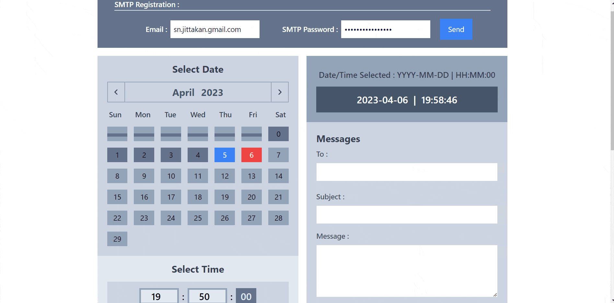

# ops-aot-email-project

By using a scheduled email system, you have the ability to write your emails in advance and set them to be sent at a particular time and date, ensuring that your message is delivered at the most appropriate moment. This not only saves you time, but also assists you in staying organized, making it a beneficial habit to adopt.

This site uses most of the recognized stack, including Spring Boot, Spring Mail, Spring Quartz, React.js, and Tailwind.css. It also uses MySQL as simple database. The system deploy locally.

*Not all features of the system are included in the repo due to confidentiality, unfinished code, and some other excuses.

*Short GIF' quality is optimized for fast load.
